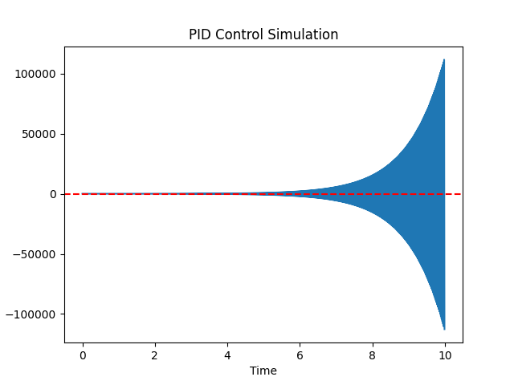
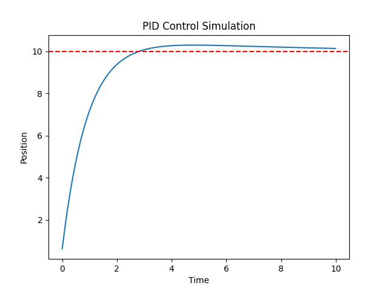

# pid-control-system-simulator
Python simulation of a PID controller demonstrating system response, overshoot, and settling behavior
# PID Control System Simulator

This project simulates how a PID (Proportional–Integral–Derivative) controller regulates a system to reach a desired target position.

The simulation demonstrates how different PID gains affect system stability, overshoot, and settling time.

## Concepts Demonstrated

- Proportional control
- Integral control
- Derivative control
- System stability
- Overshoot
- Settling time
- Steady-state error

## Unstable Response (Before PID Tuning)

Initial PID parameters caused the system to become unstable.

## Stable Response (After PID Tuning)

After adjusting the PID gains and adding damping, the system stabilizes near the target value.

## How to Run

Run the simulation using:

python pid_simulator.py

## Tools Used

- Python  
- NumPy  
- Matplotlib
